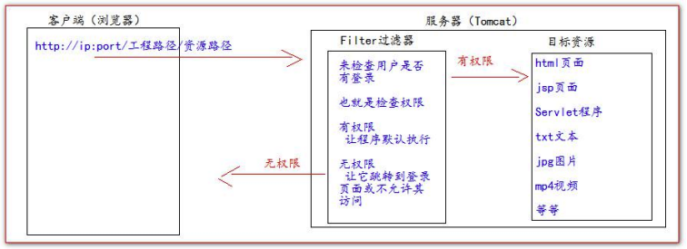
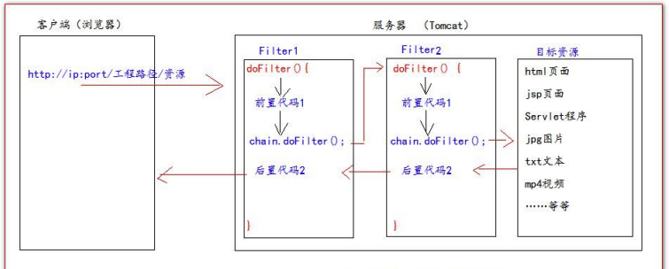

# Filter 过滤器

## 简介

* Filter 过滤器是 JavaWeb 三大组件之一
* Filter 过滤器是 JavaEE 的规范，也就是接口
* Filter 过滤器的作用是 **拦截请求**，过滤响应

拦截请求的常见应用场景：

* 权限检查
* 日志操作
* 事务管理

## 使用步骤

**使用步骤**：

* 编写一个类去实现 Filter 接口
* 实现过滤方法 doFilter()
* 到 web.xml中配置 Filter 的拦截路径，或者用注解配置

Filter 的工作流程图：



## 使用实例

**实现一个完整的用户登录**：

login.jsp 页面，登录表单：

```jsp
这是登录页面。login.jsp 页面 <br>
<form action="http://localhost:8080/15_filter/loginServlet" method="get">
    用户名：<input type="text" name="username"/> <br>
    密 码：<input type="password" name="password"/> <br>
    <input type="submit" />
</form>
```

LoginServlet 程序：

```java
public class LoginServlet extends HttpServlet {
@Override
    protected void doGet(HttpServletRequest req, HttpServletResponse resp) throws ServletException,
IOException {
    resp.setContentType("text/html; charset=UTF-8");
    String username = req.getParameter("username");
    String password = req.getParameter("password");
    if ("parzulpan".equals(username) && "123456".equals(password)) {
        req.getSession().setAttribute("user",username);
        resp.getWriter().write("登录 成功！！！");
    } else {
        req.getRequestDispatcher("/login.jsp").forward(req,resp);
    }
    }
}
```

AdminFilter 过滤器：

```java
package cn.parzulpan.web;

import javax.servlet.*;
import javax.servlet.http.HttpServletRequest;
import javax.servlet.http.HttpSession;
import java.io.IOException;

/**
 * @Author : parzulpan
 * @Time : 2020-12-13
 * @Desc :
 */

public class AdminFilter implements Filter {
    @Override
    public void init(FilterConfig filterConfig) throws ServletException {

    }

    // doFilter 方法，专门用于拦截请求，可以做权限检查
    @Override
    public void doFilter(ServletRequest servletRequest, ServletResponse servletResponse, FilterChain filterChain) throws IOException, ServletException {
        HttpServletRequest httpServletRequest = (HttpServletRequest) servletRequest;
        HttpSession session = httpServletRequest.getSession();
        Object user = session.getAttribute("user");
        // 如果等于 null，说明还没有登录
        if (user == null) {
            servletRequest.getRequestDispatcher("/login.jsp").forward(servletRequest,servletResponse);
            return;
        } else {
        // 让程序继续往下访问用户的目标资源
            filterChain.doFilter(servletRequest,servletResponse);
        }
    }

    @Override
    public void destroy() {

    }
}
```

web.xml 中的配置：

```xml
<?xml version="1.0" encoding="UTF-8"?>
<web-app xmlns="http://xmlns.jcp.org/xml/ns/javaee"
         xmlns:xsi="http://www.w3.org/2001/XMLSchema-instance"
         xsi:schemaLocation="http://xmlns.jcp.org/xml/ns/javaee http://xmlns.jcp.org/xml/ns/javaee/web-app_4_0.xsd"
         version="4.0">

    <!--filter 标签用于配置一个 Filter 过滤器-->
    <filter>
        <!--给 filter 起一个别名-->
        <filter-name>AdminFilter</filter-name>
        <!--配置 filter 的全类名-->
        <filter-class>cn.parzulpan.web.AdminFilter</filter-class>
    </filter>
    <!--filter-mapping 配置 Filter 过滤器的拦截路径-->
    <filter-mapping>
        <!--filter-name 表示当前的拦截路径给哪个 filter 使用-->
        <filter-name>AdminFilter</filter-name>
        <!--url-pattern 配置拦截路径
        / 表示请求地址为：http://ip:port/工程路径/ 映射到 IDEA 的 web 目录
        /admin/* 表示请求地址为：http://ip:port/工程路径/admin/*
        -->
        <url-pattern>/admin/*</url-pattern>
    </filter-mapping>
</web-app>
```

## 生命周期

Filter 的生命周期包含几个方法：

* 第 1 步，构造器方法
* 第 2 步，init 初始化方法
  * 第 1，2 步，在 web 工程启动的时候执行（Filter 已经创建）
* 第 3 步，doFilter 过滤方法
  * 第 3 步，每次拦截到请求就会执行
* 第 4 步，destory 销毁方法
  * 第 4 步，停止 web 工程的时候就会执行（停止 web 工程也会销毁 Filter 过滤器）

## FilterConfig 类

FilterConfig 类是 Filter 过滤器的配置文件类，Tomcat 每次创建 Filter 的时候，也会同时创建一个 FilterConfig 类，它包含了 Filte 配置文件的配置信息。

FilterConfig 类的作用是获取 Filter 过滤器的配置内容：

* `filterConfig.getFilterName()` 获取 Filter 的名称 Filter-name 的内容
* `filterConfig.getInitParameter(String param)` 获取在 Filter 中配置的 init-param 初始化参数
* `filterConfig.getServletContext()` 获取 ServletContext 对象

## FilterChain 过滤器链

Filter 是过滤器，Chain 是链条，FilterChain 就是过滤器链，指多个过滤器一起工作。



`FilteChain.doFilter()` 的使用：

* 如果有 Filter，则执行下一个 Filter 过滤器
* 如果没有 Filter，则执行目标资源
* 有 多个 Filter 的情况下，它们的执行的优先顺序是由 web.xml 中从上到下配置的顺序决定

多个 Filter 执行的特点：

* 所有的 Filter 和目标资源默认都执行在**同一个线程下**
* 多个 Filter 共同执行的时候，它们都是使用同一个 Request 对象

## Filter 拦截路径配置

* **精确匹配**
  * **`<url-pattern>/target.jsp</url-pattern>`** 表示请求地址必须是 `http://ip:port/工程路径/target.jsp` 才会被拦截
* **目录匹配**
  * **`<url-pattern>/admin/*</url-pattern>`** 表示请求地址必须是 `http://ip:port/工程路径/admin/*` 才会被拦截
* **后缀名匹配**
  * **`<url-pattern>*.html</url-pattern>`** 表示请求地址必须以 .html 结尾才会拦截
  * **`<url-pattern>*.do</url-pattern>`** 表示请求地址必须以 .do 结尾才会拦截
  * **`<url-pattern>*.action</url-pattern>`** 表示请求地址必须以 .action 结尾才会拦截

**注意**：Filter 过滤器只关心请求的地址是否被匹配，不关心请求的资源是否存在。

## 总结和练习
