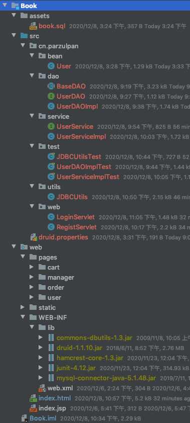

# 书城网站 项目说明

[项目地址](https://github.com/parzulpan/demo)

## 阶段一 登录、注册的验证

* 使用 jQuery 技术对登录中的用户名、密码进行非空验证；

* 使用 jQuery 技术和正则表达式对注册中的用户名、密码、确认密码、邮箱进行格式验证，对验证码进行非空验证；

```html
<script type="text/javascript" src="static/script/jquery.js"></script>
<script type="text/javascript">
    $(function() {
        $("#sub_btn").click(function () {
            // 验证用户名：必须由字母，数字下划线组成，并且长度为 5 到 12 位
            // 1. 获取用户名输入框的内容
            let username = $("#username").val();
            // 2. 创建正则表达式对象
            let usernamePattern = /^\w{5,12}$/;
            // 3. 使用 test 方法验证
            if (!usernamePattern.test(username)) {
                // 4. 提示用户
                $("span.errorMsg").text("用户名格式错误！");

                return false;
            }

            // 验证密码：必须由字母，数字下划线组成，并且长度为 5 到 12 位
            let password = $("#password").val();
            let passwordPattern = /^\w{5,12}$/;
            if (!passwordPattern.test(password)) {
                $("span.errorMsg").text("密码格式错误！");

                return false;
            }

            // 验证确认密码：和密码相同
            let repwd = $("#repwd").val();
            if (repwd !== password) {
                $("span.errorMsg").text("密码不一致！");

                return false;
            }

            // 邮箱验证：xxxxx@xxx.com
            let email = $("#email").val();
            let emailPattern = /^[a-z\d]+(\.[a-z\d]+)*@([\da-z](-[\da-z])?)+(\.{1,2}[a-z]+)+$/;
            if (!emailPattern.test(email)) {
                $("span.errorMsg").text("邮箱格式错误！");

                return false;
            }
            // 验证码：现在只需要验证用户已输入。因为还没讲到服务器。验证码生成。
            let code = $("#code").val();
            let trimCode = $.trim(code);
            if (trimCode == null || trimCode === "") {
                $("span.errorMsg").text("验证码不能为空！");

                return false;
            }

            // 验证成功，去掉提示信息
            $("span.errorMsg").text("");
        })
    })
</script>

```

## 阶段二 实现登录、注册

### 软件的三层架构

* **UIL**（User Interface Layer 表现层）：主要是指用户交互的界面，用于接收用户输入的数据和显示处理后用户需要的数据；
* **BLL**（Business Logic Layer 业务逻辑层）：表现层和数据访问层之间的桥梁，实现业务逻辑，业务逻辑包括验证、计算、业务规划等；
* DAL（Date Access Layer 数据访问层）：主要实现对数据的增、删、改、查。将存储在数据库中的数据提交给业务层，同时将业务层处理的数据保存到数据库。


**三层架构的优点**：

* 结构清晰，耦合度低；
* 可维护性高，可扩展性高；
* 利于开发任务同步进行；
* 容易适应需求变化。

**三层架构的确定**：

* 降低了系统的性能，如果不采用分层式结构，很多业务可以直接造访数据库，以此获取相应的数据，如今却必须通过中间层来完成；
* 增加了代码量，增加了工作量；

### 书城的三层架构

* 表现层
  * HTML、Servlet
  * 接受用户的请求，调用业务逻辑层处理用户请求，显示处理结果
* 业务逻辑层
  * Service
  * 调用数据访问层处理业务逻辑
  * 采用面向接口编程的思想，先定义接口，再创建实现类
* 数据访问层
  * DAO
  * 用来操作数据库，对数据库进行增删改查
  * 采用面向接口编程的思想，先定义接口，再创建实现类



**用户注册**：

* 访问注册页面
* 填写注册信息，提交给服务器
* 服务器应该保存用户
* 当用户已经存在，提示用户注册失败，用户名已存在
* 当用户不存在，注册成功

**用户登录**：

* 访问登陆页面
* 填写用户名密码后提交
* 服务器判断用户是否存在
* 如果登陆失败，返回用户名或者密码错误信息
* 如果登录成功，返回登陆成功信息

## 阶段三 动态化及局部优化

为了动态提示信息，所以需要动态化。

### 页面 jsp 动态化

* 在 html 页面顶行添加 page 指令
* 修改 `.html` 文件后缀名为：`.jsp`
* 使用 IDEA 搜索替换各个文件内容的 `.html` 为 `.jsp` （快捷键：`Ctrl+Shift+R`）

### 抽取页面中相同内容

1. head 中 css、jquery、base 标签

```jsp
<%--
  Created by IntelliJ IDEA.
  User: parzulpan
  Date: 2020/12/10
  Time: 12:03 上午
  To change this template use File | Settings | File Templates.

  抽取页面中相同的内容 head 中 css、jquery、base 标签
--%>
<%@ page contentType="text/html;charset=UTF-8" language="java" %>
<%
    String basePath = request.getScheme()
            + "://"
            + request.getServerName()
            + ":"
            + request.getServerPort()
            + request.getContextPath()
            + "/";
%>

<!--写 base 标签，永远固定相对路径跳转的结果-->
<base href="<%=basePath%>">
<link type="text/css" rel="stylesheet" href="static/css/style.css" >
<script type="text/javascript" src="static/script/jquery-1.7.2.js"></script>

```

2. 每个页面的页脚

```jsp
<%--
  Created by IntelliJ IDEA.
  User: parzulpan
  Date: 2020/12/10
  Time: 12:12 上午
  To change this template use File | Settings | File Templates.
  抽取页面中相同的内容 每个页面的页脚
--%>
<%@ page contentType="text/html;charset=UTF-8" language="java" %>
<div id="bottom">
		<span>
			购书城.Copyright &copy;2020
		</span>
</div>

```

3. 登录成功后的菜单

```jsp
<%--
  Created by IntelliJ IDEA.
  User: parzulpan
  Date: 2020/12/10
  Time: 12:12 上午
  To change this template use File | Settings | File Templates.
  抽取页面中相同的内容 登录成功后的菜单
--%>
<%@ page contentType="text/html;charset=UTF-8" language="java" %>
<div>
    <span>欢迎<span class="um_span"> JackMa</span>光临购书城</span>
    <a href="pages/order/order.jsp">我的订单</a>
    <a href="index.jsp">注销</a>&nbsp;&nbsp;
    <a href="index.jsp">返回</a>
</div>

```

4. manager 模块的菜单

```jsp
<%--
  Created by IntelliJ IDEA.
  User: parzulpan
  Date: 2020/12/10
  Time: 12:12 上午
  To change this template use File | Settings | File Templates.
  抽取页面中相同的内容 manager 模块的菜单
--%>
<%@ page contentType="text/html;charset=UTF-8" language="java" %>
<div>
    <a href="pages/manager/book_manager.jsp">图书管理</a>
    <a href="pages/manager/order_manager.jsp">订单管理</a>
    <a href="index.jsp">返回商城</a>
</div>

```

### 登录注册错误提示及表单回显

流程：

* 客户端：
  * 发送请求，登录或者注册
* 服务器：
  * 只要失败，就会跳回原来的页面，把错误信息和回显的表单项信息保存（Request 域），回传给客户端

### BaseServlet 抽取

在实际的项目开发中，一个模块，一般只使用一个 Servlet 程序。

1. 代码优化一：合并 LoginServlet 和 RegistServlet 程序为 UserServlet 程序
2. 优化代码二：使用反射优化大量 else if 代码
3. 代码优化三：抽取 BaseServlet 程序
  * 获取 action 参数值
  * 通过反射获取 action 对应的业务方法
  * 通过反射调用业务方法
  * 其他 Servlet 继承 BaseServlet

### 数据的封装和抽取 BeanUtils 的使用

BeanUtils 工具类，它可以一次性的把所有请求的参数注入到 JavaBean 中。

BeanUtils 工具类，经常用于把 Map 中的值注入到 JavaBean 中，或者是对象属性值的拷贝操作。

BeanUtils 它不是 Jdk 的类。而是第三方的工具类。所以需要导包。

1. 导入需要的 jar 包：
  * `commons-beanutils-1.8.0.jar`
  * `commons-logging-1.1.1.jar`
2. 编写 WebUtils 工具类使用
  
  ```java
  package cn.parzulpan.utils;
  
  import org.apache.commons.beanutils.BeanUtils;
  
  import java.util.Map;
  
  /**
   * @Author : parzulpan
   * @Time : 2020-12-10
   * @Desc : WebUtils 工具类
   */
  
  public class WebUtils {
  
      /**
       * 一次性的把所有请求的参数注入到 JavaBean 中
       * @param value
       * @param bean
       * @param <T>
       * @return
       */
      public static <T> T copyParamToBean(Map value, T bean) {
  
          try {
  //            System.out.println("注入之前：" + bean);
  
              BeanUtils.populate(bean, value);
  
  //            System.out.println("注入之后：" + bean);
          } catch (Exception e) {
              e.printStackTrace();
          }
  
          return bean;
      }
  }
  ```

## 阶段四 使用 EL 表达式修改表单回显

使用 EL 表达式可以简化表单的回显：

```jsp
                            <div class="msg_cont">
								<b></b>
								<span class="errorMsg">
<%--									输出回显信息--%>
<%--									<%=request.getAttribute("msg")==null?"请输入用户名和密码":request.getAttribute("msg")%>--%>
<%--									使用 EL 表达式 简化回显信息--%>
									${ empty requestScope.msg ? "请输入用户名和密码" : requestScope.msg}
								</span>
							</div>
							<div class="form">
<!--								修改注册表单的提交地址和请求方式-->
<!--								<form action="login_success.jsp">-->
<%--								<form action="loginServlet" method="post">--%>
<%--								添加隐藏域和修改请求地址--%>
								<form action="userServlet" method="post">
									<input type="hidden" name="action" value="login"/>
									<label>用户名称：</label>
									<input class="itxt" type="text" placeholder="请输入用户名"
										   autocomplete="off" tabindex="1" name="username"
<%--										   输出回显信息--%>
<%--										   value="<%=request.getAttribute("username")==null?"":request.getAttribute("username")%>"--%>
<%--										   使用 EL 表达式 简化回显信息--%>
										   value="${requestScope.username}"
									/>
									<br />
									<br />
									<label>用户密码：</label>
									<input class="itxt" type="password" placeholder="请输入密码"
										   autocomplete="off" tabindex="1" name="password" />
									<br />
									<br />
									<input type="submit" value="登录" id="sub_btn" />
								</form>
							</div>
```

## 阶段五 图书的增删改查

### MVC 概念

MVC 即 Model 模型、View 视图、Controller 控制器。MVC 最早出现在 JavaEE 三层中的 Web 层，它可以有效的指导 Web 层的代码如何有效分离，单独工作。

* Model 模型：将与业务逻辑相关的数据封装为具体的 JavaBean 类，其中不掺杂任何与数据处理相关的代码。（JavaBean、Domain、Entity）
* View 视图：只负责数据和界面的显示，不接受任何与显示数据无关的代码，便于程序员和美工的分工合作。（JSP、HTML）
* Controller 控制器：只负责接收请求，调用业务层的代码处理请求，然后派发页面（转到某个页面或者是重定向到某个页面），是一个“调度者”的角色。（Servlet）

MVC 的作用是为降低耦合，让代码合理分层，方便后期升级和维护。

### 图书模块

实现图书的增删改查。

#### 编写数据库表

```sql
drop table t_book;

create table t_book(
    `id` int primary key auto_increment,
    `name` varchar(200),
    `author` varchar(100),
    `price` decimal(11, 2),
    `sales` int,
    `stock` int,
    `imgPath` varchar(200)
);

insert into t_book(`id`, `name`, `author`, `price`, `sales`, `stock`, `imgPath`) value
    (null , 'Java 从入门到放弃' , '大哥' , 80 , 9999 , 9 , 'static/img/default.jpg'),
    (null , '数据结构与算法' , '严敏君' , 78.5 , 6 , 13 , 'static/img/default.jpg'),
    (null , '怎样拐跑别人的媳妇' , '龙伍' , 68, 99999 , 52 , 'static/img/default.jpg'),
    (null , 'C++编程思想' , '二哥' , 45.5 , 14 , 95 , 'static/img/default.jpg'),
    (null , '蛋炒饭' , '周星星' , 9.9, 12 , 53 , 'static/img/default.jpg'),
    (null , '赌神' , '龙伍' , 66.5, 125 , 535 , 'static/img/default.jpg'),
    (null , 'Java编程思想' , '阳哥' , 99.5 , 47 , 36 , 'static/img/default.jpg'),
    (null , 'JavaScript从入门到精通' , '婷姐' , 9.9 , 85 , 95 , 'static/img/default.jpg'),
    (null , 'Cocos2d-x游戏编程入门' , '大哥' , 49, 52 , 62 , 'static/img/default.jpg'),
    (null , 'C语言程序设计' , '谭浩强' , 28 , 52 , 74 , 'static/img/default.jpg'),
    (null , 'Lua语言程序设计' , '雷丰阳' , 51.5 , 48 , 82 , 'static/img/default.jpg'),
    (null , '西游记' , '罗贯中' , 12, 19 , 9999 , 'static/img/default.jpg'),
    (null , '水浒传' , '华仔' , 33.05 , 22 , 88 , 'static/img/default.jpg'),
    (null , '操作系统原理' , '刘优' , 133.05 , 122 , 188 , 'static/img/default.jpg'),
    (null , '数据结构 java版' , '封大神' , 173.15 , 21 , 81 , 'static/img/default.jpg'),
    (null , 'UNIX高级环境编程' , '乐天' , 99.15 , 210 , 810 , 'static/img/default.jpg'),
    (null , 'JavaScript高级编程' , '大哥' , 69.15 , 210 , 810 , 'static/img/default.jpg'),
    (null , '大话设计模式' , '大哥' , 89.15 , 20 , 10 , 'static/img/default.jpg'),
    (null , '人月神话' , '二哥' , 88.15 , 20 , 80 , 'static/img/default.jpg');
```

#### 编写 JavaBean

```java
public class Book {
    private Integer id;
    private String name;
    private String author;
    private BigDecimal price;
    private Integer sales;
    private Integer stock;
    private String imgPath = "static/img/default.jpg";
}
```

#### 编写 Dao 和测试

1. BookDAO 接口

```java
package cn.parzulpan.dao;

import cn.parzulpan.bean.Book;

import java.sql.Connection;
import java.util.List;

/**
 * @Author : parzulpan
 * @Time : 2020-12-10
 * @Desc : 用于规范 Book 表的常用操作
 */

public interface BookDAO {

    /**
     * 增加一本书
     * @param connection 数据库连接
     * @param book Book Bean
     * @return 返回 -1 表示操作失败；否则返回 sql 语句影响的行数
     */
    public int addBook(Connection connection, Book book);

    /**
     * 根据 书的 id 删除一本书
     * @param connection 数据库连接
     * @param id 书的 id
     * @return 返回 -1 表示操作失败；否则返回 sql 语句影响的行数
     */
    public int deleteBookById(Connection connection, Integer id);

    /**
     * 更新一本书
     * @param connection 数据库连接
     * @param book Book Bean
     * @return 返回 -1 表示操作失败；否则返回 sql 语句影响的行数
     */
    public int updateBook(Connection connection, Book book);

    /**
     * 根据 书的 id 查询一本书
     * @param connection 数据库连接
     * @param id 书的 id
     * @return Book Bean
     */
    public Book queryBookById(Connection connection, Integer id);

    /**
     * 查询所有书
     * @param connection 数据库连接
     * @return Book Bean List
     */
    public List<Book> queryBooks(Connection connection);
}
```

2. BookDAOImpl 实现类

```java
package cn.parzulpan.dao;

import cn.parzulpan.bean.Book;
import cn.parzulpan.utils.JDBCUtils;

import java.sql.Connection;
import java.util.List;

/**
 * @Author : parzulpan
 * @Time : 2020-12-10
 * @Desc :
 */

public class BookDAOImpl extends BaseDAO<Book> implements BookDAO {
    /**
     * 增加一本书
     *
     * @param connection 数据库连接
     * @param book       Book Bean
     * @return 返回 -1 表示操作失败；否则返回 sql 语句影响的行数
     */
    @Override
    public int addBook(Connection connection, Book book) {
        String sql = "insert into t_book(`name`, `author`, `price`, `sales`, `stock`, `imgPath`) values (?, ?, ?, ?, ?, ?)";
        return update(connection, sql,
                book.getName(), book.getAuthor(), book.getPrice(), book.getSales(), book.getStock(), book.getImgPath());
    }

    /**
     * 根据 书的 id 删除一本书
     *
     * @param connection 数据库连接
     * @param id         书的 id
     * @return 返回 -1 表示操作失败；否则返回 sql 语句影响的行数
     */
    @Override
    public int deleteBookById(Connection connection, Integer id) {
        String sql = "delete from t_book where id = ?";
        return update(connection, sql, id);
    }

    /**
     * 更新一本书
     *
     * @param connection 数据库连接
     * @param book       Book Bean
     * @return 返回 -1 表示操作失败；否则返回 sql 语句影响的行数
     */
    @Override
    public int updateBook(Connection connection, Book book) {
        String sql = "update t_book set `name` = ?, `author` = ?, `price` = ?, `sales` = ?, `stock` = ?, `imgPath` = ? where id = ?";
        return update(connection, sql, book.getName(), book.getAuthor(), book.getPrice(), book.getSales(),
                book.getStock(), book.getImgPath(), book.getId());
    }

    /**
     * 根据 书的 id 查询一本书
     *
     * @param connection 数据库连接
     * @param id         书的 id
     * @return Book Bean
     */
    @Override
    public Book queryBookById(Connection connection, Integer id) {
        String sql = "select `id`, `name`, `author`, `price`, `sales`, `stock`, `imgPath` from t_book where id = ?";
        return getBean(connection, sql, id);
    }

    /**
     * 查询所有书
     *
     * @param connection 数据库连接
     * @return Book Bean List
     */
    @Override
    public List<Book> queryBooks(Connection connection) {
        String sql = "select `id`, `name`, `author`, `price`, `sales`, `stock`, `imgPath` from t_book";
        return getBeanList(connection, sql);
    }
}
```

3. BookDAOImplTest 单元测试

```java
package cn.parzulpan.test;

import cn.parzulpan.bean.Book;
import cn.parzulpan.dao.BookDAO;
import cn.parzulpan.dao.BookDAOImpl;
import cn.parzulpan.utils.JDBCUtils;
import org.junit.Test;

import java.math.BigDecimal;
import java.sql.Connection;
import java.util.List;


/**
 * @Author : parzulpan
 * @Time : 2020-12-10
 * @Desc :
 */

public class BookDAOImplTest {
    private BookDAO bookDAO = new BookDAOImpl();

    @Test
    public void addBook() {
        Connection connection = JDBCUtils.getConnection();
        int addBook = bookDAO.addBook(connection,
                new Book(null, "测试的书", "测试的作者",
                        new BigDecimal(120), 100, 10, null));
        System.out.println(addBook);
        JDBCUtils.close(connection, null, null);
    }

    @Test
    public void deleteBookById() {
        Connection connection = JDBCUtils.getConnection();
        int deleteBookById = bookDAO.deleteBookById(connection, 20);
        System.out.println(deleteBookById);
        JDBCUtils.close(connection, null, null);
    }

    @Test
    public void updateBook() {
        Connection connection = JDBCUtils.getConnection();
        int updateBook = bookDAO.updateBook(connection,
                new Book(2, "更新的书", "更新的作者",
                        new BigDecimal(120), 100, 10, null));
        System.out.println(updateBook);
        JDBCUtils.close(connection, null, null);
    }

    @Test
    public void queryBookById() {
        Connection connection = JDBCUtils.getConnection();
        Book queryBookById = bookDAO.queryBookById(connection, 2);
        System.out.println(queryBookById);
        JDBCUtils.close(connection, null, null);
    }

    @Test
    public void queryBooks() {
        Connection connection = JDBCUtils.getConnection();
        List<Book> books = bookDAO.queryBooks(connection);
        books.forEach(System.out::println);
        JDBCUtils.close(connection, null, null);
    }
}
```

#### 编写 Service 和测试

1. BookService 接口

```java
package cn.parzulpan.service;

import cn.parzulpan.bean.Book;
import cn.parzulpan.dao.BookDAOImpl;

import java.sql.Connection;
import java.util.List;

/**
 * @Author : parzulpan
 * @Time : 2020-12-10
 * @Desc :
 */

public interface BookService {

    /**
     * 增加一本书
     * @param book Book Bean
     * @return 返回 -1 表示操作失败；否则返回 sql 语句影响的行数
     */
    public int addBook(Book book);

    /**
     * 根据 书的 id 删除一本书
     * @param id 书的 id
     * @return 返回 -1 表示操作失败；否则返回 sql 语句影响的行数
     */
    public int deleteBookById(Integer id);

    /**
     * 更新一本书
     * @param book Book Bean
     * @return 返回 -1 表示操作失败；否则返回 sql 语句影响的行数
     */
    public int updateBook(Book book);

    /**
     * 根据 书的 id 查询一本书
     * @param id 书的 id
     * @return Book Bean
     */
    public Book queryBookById(Integer id);

    /**
     * 查询所有书
     * @return Book Bean List
     */
    public List<Book> queryBooks();
}
```

2. BookServiceImpl 实现类

```java
package cn.parzulpan.service;

import cn.parzulpan.bean.Book;
import cn.parzulpan.dao.BookDAO;
import cn.parzulpan.dao.BookDAOImpl;
import cn.parzulpan.utils.JDBCUtils;

import java.math.BigDecimal;
import java.sql.Connection;
import java.util.List;

/**
 * @Author : parzulpan
 * @Time : 2020-12-10
 * @Desc :
 */

public class BookServiceImpl implements BookService {
    private BookDAO bookDAO = new BookDAOImpl();

    /**
     * 增加一本书
     *
     * @param book Book Bean
     * @return 返回 -1 表示操作失败；否则返回 sql 语句影响的行数
     */
    @Override
    public int addBook(Book book) {
        Connection connection = JDBCUtils.getConnection();
        int i = bookDAO.addBook(connection, book);
        JDBCUtils.close(connection, null, null);
        return i;
    }

    /**
     * 根据 书的 id 删除一本书
     *
     * @param id 书的 id
     * @return 返回 -1 表示操作失败；否则返回 sql 语句影响的行数
     */
    @Override
    public int deleteBookById(Integer id) {
        Connection connection = JDBCUtils.getConnection();
        int deleteBookById = bookDAO.deleteBookById(connection, id);
        JDBCUtils.close(connection, null, null);
        return deleteBookById;
    }

    /**
     * 更新一本书
     *
     * @param book Book Bean
     * @return 返回 -1 表示操作失败；否则返回 sql 语句影响的行数
     */
    @Override
    public int updateBook(Book book) {
        Connection connection = JDBCUtils.getConnection();
        int updateBook = bookDAO.updateBook(connection, book);
        JDBCUtils.close(connection, null, null);
        return updateBook;
    }

    /**
     * 根据 书的 id 查询一本书
     *
     * @param id 书的 id
     * @return Book Bean
     */
    @Override
    public Book queryBookById(Integer id) {
        Connection connection = JDBCUtils.getConnection();
        Book queryBookById = bookDAO.queryBookById(connection, id);
        JDBCUtils.close(connection, null, null);
        return queryBookById;
    }

    /**
     * 查询所有书
     *
     * @return Book Bean List
     */
    @Override
    public List<Book> queryBooks() {
        Connection connection = JDBCUtils.getConnection();
        List<Book> books = bookDAO.queryBooks(connection);
        JDBCUtils.close(connection, null, null);
        return books;
    }
}
```

3. BookServiceImplTest 单元测试

```java
package cn.parzulpan.test;

import cn.parzulpan.bean.Book;
import cn.parzulpan.dao.BookDAO;
import cn.parzulpan.dao.BookDAOImpl;
import cn.parzulpan.utils.JDBCUtils;
import org.junit.Test;

import java.math.BigDecimal;
import java.sql.Connection;
import java.util.List;


/**
 * @Author : parzulpan
 * @Time : 2020-12-10
 * @Desc :
 */

public class BookDAOImplTest {
    private BookDAO bookDAO = new BookDAOImpl();

    @Test
    public void addBook() {
        Connection connection = JDBCUtils.getConnection();
        int addBook = bookDAO.addBook(connection,
                new Book(null, "测试的书", "测试的作者",
                        new BigDecimal(120), 100, 10, null));
        System.out.println(addBook);
        JDBCUtils.close(connection, null, null);
    }

    @Test
    public void deleteBookById() {
        Connection connection = JDBCUtils.getConnection();
        int deleteBookById = bookDAO.deleteBookById(connection, 20);
        System.out.println(deleteBookById);
        JDBCUtils.close(connection, null, null);
    }

    @Test
    public void updateBook() {
        Connection connection = JDBCUtils.getConnection();
        int updateBook = bookDAO.updateBook(connection,
                new Book(2, "更新的书", "更新的作者",
                        new BigDecimal(120), 100, 10, null));
        System.out.println(updateBook);
        JDBCUtils.close(connection, null, null);
    }

    @Test
    public void queryBookById() {
        Connection connection = JDBCUtils.getConnection();
        Book queryBookById = bookDAO.queryBookById(connection, 2);
        System.out.println(queryBookById);
        JDBCUtils.close(connection, null, null);
    }

    @Test
    public void queryBooks() {
        Connection connection = JDBCUtils.getConnection();
        List<Book> books = bookDAO.queryBooks(connection);
        books.forEach(System.out::println);
        JDBCUtils.close(connection, null, null);
    }
}
```


#### 编写 Web 和测试

##### 图书列表功能的实现

**实现步骤**：

* 在后台管理页面点击**图书管理**，所以需要修改图书管理请求地址 `<a href="bookServlet?action=list">图书管理</a>`
* 在 BookServlet 程序中添加 list 方法：
  * 查询全部图书
  * 保存到 Request 域中
  * **请求转发**到 book_manager.jsp 图书管理页面
* book_manager.jsp 图书管理页面展示所有的图书信息
  * 从 Request 域中获取全部图书信息
  * 使用 `JSTL` 标签库遍历输出
     * 导入 `taglibs-standard-impl-1.2.1.jar` 和 `taglibs-standard-spec-1.2.1.jar`
     * 修改 book_manager.jsp 页面的数据遍历输出

```java
@WebServlet(name = "BookServlet", urlPatterns = ("/bookServlet"))
public class BookServlet extends BaseServlet {
    private BookService bookService  = new BookServiceImpl();

    // 查询全部图书
    protected void list(HttpServletRequest request, HttpServletResponse response) throws ServletException, IOException {
        List<Book> books = bookService.queryBooks();
        request.setAttribute("books", books);
        // 请求转发，这里不能用请求重定向，想想为什么？
        // 因为请求转发的特点是：浏览器地址栏不发生变化；一次请求；共享 Request 域中的数据
        // 当用户提交完请求，浏览器会记录下最后一次请求的全部信息，当用户按下功能键 F5，就会发起浏览器记录的最后一次
           请求。
        // 所以必须是一次请求
        request.getRequestDispatcher("/pages/manager/book_manager.jsp").forward(request, response);
    }
}
```

##### 添加图书功能的实现

**实现步骤**：

* 在图书管理页面点击添加按钮，跳转到 book_edit.jsp 添加图书页面
* 在添加图书页面填写相关信息，点击提交按钮
* 在 BookServlet 程序中添加 add 方法：
  * 获取请求的参数，封装成为 Book 对象
  * 调用 bookService.addBook(book) 保存图书
  * **请求重定向**图书列表页面

```java
@WebServlet(name = "BookServlet", urlPatterns = ("/bookServlet"))
public class BookServlet extends BaseServlet {
    private BookService bookService  = new BookServiceImpl();

    // 添加图书
    protected void add(HttpServletRequest request, HttpServletResponse response) throws ServletException, IOException {
        // 中文编码问题
        Book book = WebUtils.copyParamToBean(request.getParameterMap(), new Book());
        bookService.addBook(book);
        // 请求重定向，这里不能用请求转发，想想为什么？
        // 因为请求重定向的特点是：浏览器地址栏会发生变化；两次请求；不共享 Request 域中的数据
        response.sendRedirect("bookServlet?action=list");
    }
}
```

##### 删除图书功能的实现

**实现步骤**：

* 在图书管理页面点击删除按钮（`<td><a class="deleteClass" href="bookServlet?action=delete&id=${book.id}">删除</a></td>`）
* 给删除添加确认提示操作
* 在 BookServlet 程序中添加 delete 方法：
  * 获取请求的参数 id
  * 调用 bookService.deleteBookById(id) 删除图书
  * **请求重定向**图书列表页面

```java
@WebServlet(name = "BookServlet", urlPatterns = ("/bookServlet"))
public class BookServlet extends BaseServlet {
    private BookService bookService  = new BookServiceImpl();

    // 删除图书
    protected void delete(HttpServletRequest request, HttpServletResponse response) throws ServletException, IOException {
        int id = WebUtils.parseInt(request.getParameter("id"));
        bookService.deleteBookById(id);
        response.sendRedirect("bookServlet?action=list");
    }
}
```

##### 修改图书功能的实现

**实现步骤**：

* 在图书管理页面点击修改按钮（`<td><a href="bookServlet?action=getBook&id=${book.id}">修改</a></td>`）
* 在 BookServlet 程序中添加 getBook 方法，获取要修改的图书信息：
  * 获取图书编号
  * 调用 bookService.queryBookById(id) 获取图书信息
  * 把信息保存到 Request 域中
  * **请求转发**到 `book_edit.jsp` 图书编辑页面
* 在 BookServlet 程序中添加 update 方法，保存修改图书的操作：
  * 获取请求的参数，封装成为 Book 对象
  * 调用 bookService.updateBook(book) 修改图书
  * **请求重定向**图书列表页面
* 解决 `book_edit.jsp` 图书编辑页面，即要实现添加，又要实现修改操作：
  * 方案一：可以请求发起时，附带上当前要操作的值，并注入到隐藏域中 `<td><a href="bookServlet?action=getBook&id=${book.id}&method=add">修改</a></td>
                                     					   <td><a href="pages/manager/book_edit.jsp&method=update">添加图书</a></td>`
  * **方案二**：可以通过判断当前请求参数中是否包含 id 参数，如果有说明是修改操作，否则是添加操作 `<input type="hidden" name="action" value="${ empty param.id ? "add" : "update" }"/>`
  * 方案三：可以通过判断 Request 域中是否包含要修改的图书信息对象，如果有说明是修改操作 `<input type="hidden" name="id" value="${ empty requestScope.book ? "add" : "update }"/>`

```java
@WebServlet(name = "BookServlet", urlPatterns = ("/bookServlet"))
public class BookServlet extends BaseServlet {
    private BookService bookService  = new BookServiceImpl();

    // 查询图书
    protected void getBook(HttpServletRequest request, HttpServletResponse response) throws ServletException, IOException {
        int id = WebUtils.parseInt(request.getParameter("id"));
        Book book = bookService.queryBookById(id);
        request.setAttribute("book", book);
        request.getRequestDispatcher("/pages/manager/book_edit.jsp").forward(request, response);
    }

    // 更新图书
    protected void update(HttpServletRequest request, HttpServletResponse response) throws ServletException, IOException {
        Book book = WebUtils.copyParamToBean(request.getParameterMap(), new Book());
        bookService.updateBook(book);
        response.sendRedirect("bookServlet?action=list");
    }
}
```

### 图书分页

#### 分页模块的分析

由分页的视图分析出分页的对象模型 Page 类，它包括的属性有：

* pageNo         当前页面     它是由客户端进行传递
* pageSize       每页显示数量  它是由客户端进行传递和是由页面布局决定
* pageTotalCount 总记录数     它是由 `select count(*) from 表名` 得到
* pageTotal      总页码       它是由 总记录数 / 每页数量 得到，注意有余数的情况
* item           当前页数据    它是由 `select * form 表名 limit begin, pageSize` 得到，`begin = (pageNo - 1) * pageSize`

点击页码需要传递两个参数：pageNo，pageSize

* BookServlet 程序添加 page 方法处理这个请求：
  * 获取请求的参数 pageNo，pageSize
  * 调用 BookService.page(pageNo, pageSize)，返回 page 对象
  * 保存在 Request 域中
  * 请求转发到 book_manager.jsp 页面
* BookService 程序，处理分页业务
  * `public Page page(pageNo, pageSize)`
  * 得到总记录数、总页码、当前页数据
* BookDAO 程序
  * queryForPageTotalCount() 求总记录数 `select count(*) from 表名`
  * queryForItems(begin, pageSize) 求当前页数据 `select * from 表名 limit begin, pageSize`

#### 分页模型 Page 的抽取

```java
package cn.parzulpan.bean;

import java.util.List;

/**
 * @Author : parzulpan
 * @Time : 2020-12-11
 * @Desc :
 */

/**
 * Page 是分页的模型对象
 * @param <T> 是具体的模块的 JavaBean 类
 */
public class Page<T> {
    public static final Integer PAGE_SIZE = 4;

    private Integer pageNo; // 当前页码
    private Integer pageTotal;  // 总页码
    private Integer pageSize = PAGE_SIZE;   // 当前页显示数量
    private Integer pageTotalCount; // 总记录数
    private List<T> items;  // 当前页数据

    public Page() {
    }

    public Page(Integer pageNo, Integer pageTotal, Integer pageSize, Integer pageTotalCount, List<T> items) {
        this.pageNo = pageNo;
        this.pageTotal = pageTotal;
        this.pageSize = pageSize;
        this.pageTotalCount = pageTotalCount;
        this.items = items;
    }

    public static Integer getPageSize() {
        return PAGE_SIZE;
    }

    public void setPageSize(Integer pageSize) {
        this.pageSize = pageSize;
    }

    public Integer getPageTotalCount() {
        return pageTotalCount;
    }

    public void setPageTotalCount(Integer pageTotalCount) {
        this.pageTotalCount = pageTotalCount;
    }

    public List<T> getItems() {
        return items;
    }

    public void setItems(List<T> items) {
        this.items = items;
    }

    public Integer getPageNo() {
        return pageNo;
    }

    public void setPageNo(Integer pageNo) {
        /* 数据边界的有效检查 */
        if (pageNo < 1) {
            pageNo = 1;
        }
        if (pageNo > pageTotal) {
            pageNo = pageTotal;
        }
        this.pageNo = pageNo;
    }

    public Integer getPageTotal() {
        return pageTotal;
    }

    public void setPageTotal(Integer pageTotal) {
        this.pageTotal = pageTotal;
    }

    @Override
    public String toString() {
        return "Page{" +
                "pageNo=" + pageNo +
                ", pageTotal=" + pageTotal +
                ", pageSize=" + pageSize +
                ", pageTotalCount=" + pageTotalCount +
                ", items=" + items +
                '}';
    }
}
```

#### 分页的初步实现

BookDAO：

```java
    @Override
    public Integer queryForPageTotalCount(Connection connection) {
        String sql = "select count(*) from t_book";
        Number count = (Number) getValue(connection, sql);
        return count.intValue();
    }

    @Override
    public List<Book> queryForPageItems(Connection connection, int begin, int pageSize) {
        String sql = "select `id`, `name`, `author`, `price`, `sales`, `stock`, `imgPath` from t_book limit ?, ?";
        return getBeanList(connection, sql, begin, pageSize);
    }
```

BookService：

```java
 @Override
    public Page<Book> page(int pageNo, int pageSize) {
        Page<Book> page = new Page<>();
        Connection connection = JDBCUtils.getConnection();

        page.setPageNo(pageNo); // 设置当前页码
        page.setPageSize(pageSize); // 设置每页显示的数量
        Integer pageTotalCount = bookDAO.queryForPageTotalCount(connection);
        page.setPageTotalCount(pageTotalCount); // 设置总记录数
        int pageTotal = pageTotalCount / pageSize;
        if (pageTotalCount % pageSize > 0) {
            pageTotal += 1;
        }
        page.setPageTotal(pageTotal);   // 设置总页码
        int begin = (page.getPageNo() - 1) * pageSize;  // 求当前页数据的开始索引
        List<Book> items = bookDAO.queryForPageItems(connection, begin,pageSize);   // 求当前页数据
        page.setItems(items);

        JDBCUtils.close(connection, null, null);

        return page;
```

BookServlet：

```java
    // 处理分页
    protected void page(HttpServletRequest request, HttpServletResponse response) throws ServletException, IOException {
        int pageNo = WebUtils.parseInt(request.getParameter("pageNo"), 1);
        int pageSize = WebUtils.parseInt(request.getParameter("pageSize"), Page.PAGE_SIZE);
        Page<Book> page = bookService.page(pageNo, pageSize);
        request.setAttribute("page", page);
        request.getRequestDispatcher("/pages/manager/book_manager.jsp").forward(request, response);
    }
```

#### 跳转增加回显页码

```jsp

<%--		添加分页--%>
		<div id="page_nav">
<%--			<a href="#">首页</a>--%>
<%--			<a href="#">上一页</a>--%>
			<c:if test="${requestScope.page.pageNo > 1}">
				<a href="bookServlet?action=page&pageNo=1">首页</a>
				<a href="bookServlet?action=page&pageNo=${requestScope.page.pageNo-1}">上一页</a>
			</c:if>

<%--			<a href="#">3</a>--%>
<%--			【${requestScope.page.pageNo}】--%>
<%--			<a href="#">5</a>--%>
			<%--页码输出的开始--%>
			<c:choose>
				<%--情况 1：如果总页码小于等于 5 的情况，页码的范围是：1-总页码--%>
				<c:when test="${ requestScope.page.pageTotal <= 5 }">
					<c:set var="begin" value="1"/>
					<c:set var="end" value="${requestScope.page.pageTotal}"/>
				</c:when>
				<%--情况 2：总页码大于 5 的情况--%>
				<c:when test="${requestScope.page.pageTotal > 5}">
					<c:choose>
						<%--小情况 1：当前页码为前面 3 个：1，2，3 的情况，页码范围是：1-5.--%>
						<c:when test="${requestScope.page.pageNo <= 3}">
							<c:set var="begin" value="1"/>
							<c:set var="end" value="5"/>
						</c:when>
						<%--小情况 2：当前页码为最后 3 个，8，9，10，页码范围是：总页码减 4 - 总页码--%>
						<c:when test="${requestScope.page.pageNo > requestScope.page.pageTotal-3}">
							<c:set var="begin" value="${requestScope.page.pageTotal-4}"/>
							<c:set var="end" value="${requestScope.page.pageTotal}"/>
						</c:when>
						<%--小情况 3：4，5，6，7，页码范围是：当前页码减 2 - 当前页码加 2--%>
						<c:otherwise>
							<c:set var="begin" value="${requestScope.page.pageNo-2}"/>
							<c:set var="end" value="${requestScope.page.pageNo+2}"/>
						</c:otherwise>
					</c:choose>
				</c:when>
			</c:choose>
			<c:forEach begin="${begin}" end="${end}" var="i">
				<c:if test="${i == requestScope.page.pageNo}">
					【${i}】
				</c:if>
				<c:if test="${i != requestScope.page.pageNo}">
					<a href="bookServlet?action=page&pageNo=${i}">${i}</a>
				</c:if>
			</c:forEach>
			<%--页码输出的结束--%>


<%--			<a href="#">下一页</a>--%>
<%--			<a href="#">末页</a>--%>
			<c:if test="${requestScope.page.pageNo < requestScope.page.pageTotal}">
				<a href="bookServlet?action=page&pageNo=${requestScope.page.pageNo+1}">下一页</a>
				<a href="bookServlet?action=page&pageNo=${requestScope.page.pageTotal}">末页</a>
			</c:if>

<%--			共${ requestScope.page.pageTotal }页，${requestScope.page.pageTotalCount} 条记录--%>
<%--			跳转到第 <input value="4" name="pn" id="pn_input"/> 页--%>
<%--			<input type="button" value="确定">--%>
			共${ requestScope.page.pageTotal }页，${requestScope.page.pageTotalCount} 条记录
			，跳转到第 <input value="${param.pageNo}" name="pn" id="pn_input"/> 页
			<input id="searchPageBtn" type="button" value="确定">
		</div>
	</div>

```

#### 首页的跳转

* web 目录下的 index.jsp，请求转发到 ClientBookServlet 程序
* ClientBookServlet 程序中处理分页，请求转发到 /pages/client/index.jsp

#### 分页条的抽取

因为除了分页条的请求地址不同，其他全部相同。所以可以抽取，然后包含。

**步骤**：

* 抽取分页条中请求地址为 url 变量
  * 在 page 对象中添加 url 属性
  * 在 Servlet 程序的 page 分页方法中分别设置 url 的分页请求地址
  * 修改分页条中请求地址为 url 变量输出,并抽取一个单独的 jsp 页面

#### 首页价格搜索

* 点击价格查询按钮，传递两个参数：pageNo，pageSize, min, max

* ClientBookServlet 程序添加 pageByPrice 方法处理这个请求：
  * 获取请求的参数 pageNo，pageSize, min, max
  * 调用 BookService.pageByPrice(pageNo, pageSize, min, max)，返回 page 对象
  * 保存在 Request 域中
  * 请求转发到 /pages/client/index.jsp 页面
* BookService 程序，处理价格区间分页业务
  * `public Page page(pageNo, pageSizee, min, max)`
  * 得到总记录数、总页码、当前页数据
* BookDAO 程序
  * queryForPageTotalCount(min, max) 求总记录数 `select count(*) from 表名 where price between min and max`
  * queryForItems(begin, pageSize, min, max) 求当前页数据 `select * from 表名 where price between min and max order by price limit begin, pageSize`

## 阶段六 登录、登出、验证码

### 登录-显示用户名

* UserServlet 程序中保存用户登录的信息
* 修改 login_success_menu.jsp 页面
* 修改 index.jsp 页面的菜单

### 登出-注销用户

* 销毁 Session 中用户登录的信息（或者销毁 Session）
* 重定向到首页（或登录页面）。

### 表单重复提交解决-验证码

表单重复提交有三种常见的情况：
* 一：提交完表单。服务器使用请求转来进行页面跳转。这个时候，用户按下功能键 F5，就会发起最后一次的请求。造成表单重复提交问题。**解决方法：使用重定向来进行跳转**
* 二：用户正常提交服务器，但是由于网络延迟等原因，迟迟未收到服务器的响应，这个时候，用户以为提交失败，就会着急，然后多点了几次提交操作，也会造成表单重复提交。
* 三：用户正常提交服务器。服务器也没有延迟，但是提交完成后，用户回退浏览器。重新提交。也会造成表单重复提交。

**验证码解决表单重复提交的底层原理**：

* 当用户第一次访问表单时，就要给表单生成一个随机的验证码字符串
* 把这个验证码字符串保存在 Session 域中
* 并把这个验证码字符串以图片等形式显示在表单项中
* 点击 "提交" 按钮，Servlet 程序就要获取 Session 域中的验证码，并删除 Session 域中的验证码
* Servlet 程序再获取表单项信息
* 比较这个验证码和表单中的验证码是否相等
  * 相等，则允许操作
  * 不相等，则阻止操作

### kaptcha 的使用

谷歌验证码 kaptcha 使用步骤：
* 导入谷歌验证码的 jar 包 `kaptcha-2.3.2.jar`
* 在 web.xml 中去配置用于生成验证码的 Servlet 程序

    ```xml
        <servlet>
            <servlet-name>KaptchaServlet</servlet-name>
            <servlet-class>com.google.code.kaptcha.servlet.KaptchaServlet</servlet-class>
        </servlet>
        <servlet-mapping>
            <servlet-name>KaptchaServlet</servlet-name>
            <url-pattern>/kaptcha.jpg</url-pattern>
        </servlet-mapping>
    ```

* 在表单中使用 img 标签去显示验证码图片并使用它

    ```jsp
    
    <label>验证码：</label>
    <label for="code"></label><input class="itxt" type="text" style="width: 150px;" name="code"  id="code"/>
    
    <br />
    <br />
    <input type="submit" value="注册" id="sub_btn" />
    
    ```

* 在服务器获取谷歌生成的验证码和客户端发送过来的验证码比较使用

    ```java
    // 获取 Session 中的验证码
    String token = (String)request.getSession().getAttribute(KAPTCHA_SESSION_KEY);
    // 删除 Session 中的验证码
    request.getSession().removeAttribute(KAPTCHA_SESSION_KEY);
    ```

* 切换验证码

    ```javascript
    // 给验证码的图片，绑定单击事件
    $("#code_img").click(function () {
      // 在事件响应的 function 函数中有一个 this 对象。这个 this 对象，是当前正在响应事件的 dom 对象
      // src 属性表示验证码 img 标签的 图片路径。它可读，可写
      // alert(this.src);
      this.src = "${basePath}kaptcha.jpg?d=" + new Date();
    });
    ```

## 阶段七 购物车和订单管理

### 购物车

#### 购物车模块分析

实现购物车功能的技术有：

* Session 版本，即把购物车信息保存到 Session 域中，**这次使用这个版本**
* 数据库版本，即把购物车信息保存到数据库中
* Redis + 数据库 + Cookie 版本，即使用 Cookie + Redis 缓存，数据库保存

由购物车的界面分析出购物车的模型：

* Cart 购物车对象
  * totalCount 总商品数量
  * totalPrice 总商品金额
  * items      购物车商品
* CartItem 购物车商品项
  * id         商品编号
  * name       商品名称
  * count      商品数量
  * price      商品单价
  * totalPrice 商品总价
  
购物车功能：

* **加入购物车**  `CartServlet 程序中 addItem()`  `Cart对象 addItem(CartItem)`
* **删除购物车中商品**  `CartServlet 程序中 deleteItem()`  `Cart对象 deleteItem(id)`
* **清空购物车**       `CartServlet 程序中 clear()`  `Cart对象 clear()`
* **修改购物车中商品**  `CartServlet 程序中 updateCount()`  `Cart对象 updateCount(id, count)`

#### 购物车模块实现

```java
package cn.parzulpan.bean;

import java.math.BigDecimal;

/**
 * @Author : parzulpan
 * @Time : 2020-12-13
 * @Desc : 购物车的商品项
 */

public class CartItem {
    private Integer id; // 商品编号
    private String name;    // 商品名称
    private Integer count;  // 商品数量
    private BigDecimal price;   // 商品单价
    private BigDecimal totalPrice;  // 商品总价

    public CartItem() {
    }

    public CartItem(Integer id, String name, Integer count, BigDecimal price, BigDecimal totalPrice) {
        this.id = id;
        this.name = name;
        this.count = count;
        this.price = price;
        this.totalPrice = totalPrice;
    }

    public Integer getId() {
        return id;
    }

    public void setId(Integer id) {
        this.id = id;
    }

    public String getName() {
        return name;
    }

    public void setName(String name) {
        this.name = name;
    }

    public Integer getCount() {
        return count;
    }

    public void setCount(Integer count) {
        this.count = count;
    }

    public BigDecimal getPrice() {
        return price;
    }

    public void setPrice(BigDecimal price) {
        this.price = price;
    }

    public BigDecimal getTotalPrice() {
        return totalPrice;
    }

    public void setTotalPrice(BigDecimal totalPrice) {
        this.totalPrice = totalPrice;
    }

    @Override
    public String toString() {
        return "CartItem{" +
                "id=" + id +
                ", name='" + name + '\'' +
                ", count=" + count +
                ", price=" + price +
                ", totalPrice=" + totalPrice +
                '}';
    }
}
```

```java
package cn.parzulpan.bean;

import java.math.BigDecimal;
import java.util.LinkedHashMap;
import java.util.Map;

/**
 * @Author : parzulpan
 * @Time : 2020-12-13
 * @Desc : 购物车对象
 */

public class Cart {
//    private Integer totalCount;
//    private BigDecimal totalPrice;
    private Map<Integer, CartItem> items = new LinkedHashMap<>();   // 购物车商品，key 是商品编号，value 是商品信息

    /**
     * 加入购物车
     * @param cartItem
     */
    public void addItem(CartItem cartItem) {
        CartItem item = items.get(cartItem.getId());
        if (item == null) {
            items.put(cartItem.getId(), cartItem);
        } else {
            item.setCount(item.getCount() + 1);
            item.setTotalPrice(item.getPrice().multiply(new BigDecimal(item.getCount())));
        }

    }

    /**
     * 删除购物车中商品
     * @param id
     */
    public void deleteItem(Integer id) {
        items.remove(id);
    }

    /**
     * 清空购物车
     */
    public void clear() {
        items.clear();
    }

    /**
     * 修改购物车中商品
     * @param id
     * @param count
     */
    public void updateCount(Integer id, Integer count) {
        CartItem item = items.get(id);
        if (item != null) {
            item.setCount(count);
            item.setTotalPrice(item.getPrice().multiply(new BigDecimal(item.getCount())));
        }
    }

    public Integer getTotalCount() {
        Integer totalCount = 0;
        for (Map.Entry<Integer, CartItem> entry : items.entrySet()) {
            totalCount += entry.getValue().getCount();
        }

        return totalCount;
    }

    public BigDecimal getTotalPrice() {
        BigDecimal totalPrice = new BigDecimal(0);
        for (Map.Entry<Integer, CartItem> entry : items.entrySet()) {
            totalPrice = totalPrice.add(entry.getValue().getTotalPrice());
        }

        return totalPrice;
    }

    public Map<Integer, CartItem> getItems() {
        return items;
    }

    public void setItems(Map<Integer, CartItem> items) {
        this.items = items;
    }

    @Override
    public String toString() {
        return "Cart{" +
                "items=" + items +
                '}';
    }
}
```

#### 加入购物车

```java
 // 加入购物车
protected void addItem(HttpServletRequest request, HttpServletResponse response) throws ServletException, IOException {
    // 获取请求的参数
    int id = WebUtils.parseInt(request.getParameter("id"), 0);
    // 得到图书信息
    Book book = bookService.queryBookById(id);
    // 把图书信息转换为 CartItem
    CartItem cartItem = new CartItem(book.getId(), book.getName(), 1, book.getPrice(), book.getPrice());
    // 调用 Cart.addItem(CartItem); 添加商品项
    Cart cart = (Cart)request.getSession().getAttribute("cart");
    if (cart == null) {
        cart = new Cart();
        request.getSession().setAttribute("cart", cart);
    }
    cart.addItem(cartItem);

    System.out.println(cart);
    System.out.println("请求头 Referer 的值：" + request.getHeader("Referer"));

    // 如果跳回添加商品的页面？
    // 在 HTTP 协议中有一个请求头，叫 Referer，它可以把请求发起时的浏览器地址栏的地址发送给服务器
    // 重定向回原来商品所在的地址页面
//        response.sendRedirect(request.getContextPath());
    response.sendRedirect(request.getHeader("Referer"));
}
```

#### 展示购物车

```jsp
<%--cart.jsp--%>

            <%--输出 Session 域中的数据--%>
			<%--如果购物车为空--%>
			<c:if test="${empty sessionScope.cart.items}">
				<tr>
					<td colspan="5"><a href="index.jsp">亲，当前购物车为空！快去添加商品吧～</a></td>
				</tr>
			</c:if>
			<%--如果购物车不为空--%>
			<c:if test="${not empty sessionScope.cart.items}">
				<c:forEach items="${sessionScope.cart.items}" var="entry">
					<tr>
						<td>${entry.value.name}</td>
						<td>${entry.value.count}</td>
						<td>${entry.value.price}</td>
						<td>${entry.value.totalPrice}</td>
						<td><a href="#">删除</a></td>
					</tr>
				</c:forEach>
			</c:if>

		</table>
		<%--如果购物车非空才输出页面的内容--%>
		<c:if test="${not empty sessionScope.cart.items}">
			<div class="cart_info">
				<span class="cart_span">购物车中共有<span class="b_count">${sessionScope.cart.totalCount}</span>件商品</span>
				<span class="cart_span">总金额<span class="b_price">${sessionScope.cart.totalPrice}</span>元</span>
				<span class="cart_span"><a href="#">清空购物车</a></span>
				<span class="cart_span"><a href="pages/cart/checkout.jsp">去结账</a></span>
			</div>
		</c:if>

```

#### 删除购物车中商品

```java
// 删除购物车中商品
protected void deleteItem(HttpServletRequest request, HttpServletResponse response) throws ServletException, IOException {
    // 获取请求的参数
    int id = WebUtils.parseInt(request.getParameter("id"), 0);
    // 获得购物车对象
    Cart cart = (Cart)request.getSession().getAttribute("cart");

    if (cart != null) {
        cart.deleteItem(id);
        // 重定向回原来购物车展示页面
        response.sendRedirect(request.getHeader("Referer"));
    }
}
```

#### 清空购物车

```java
// 清空购物车
protected void clear(HttpServletRequest request, HttpServletResponse response) throws ServletException, IOException {
    // 获得购物车对象
    Cart cart = (Cart)request.getSession().getAttribute("cart");
    if (cart != null) {
        cart.clear();
        // 重定向回原来购物车展示页面
        response.sendRedirect(request.getHeader("Referer"));
    }
}
```

#### 修改购物车中商品

```java
// 修改购物车中商品
protected void updateCount(HttpServletRequest request, HttpServletResponse response) throws ServletException, IOException {
    // 获取请求的参数
    int id = WebUtils.parseInt(request.getParameter("id"), 0);
    int count = WebUtils.parseInt(request.getParameter("count"), 1);
    // 获得购物车对象
    Cart cart = (Cart)request.getSession().getAttribute("cart");
    if (cart != null) {
        cart.updateCount(id, count);
        // 重定向回原来购物车展示页面
        response.sendRedirect(request.getHeader("Referer"));
    }
}
```

#### 回显购物车数据

在添加商品到购物车的时候，保存最后一个添加的商品名称。

### 订单

#### 订单模块分析

由订单的界面分析出订单的模型：

* Order 订单对象
  * orderId    订单号（唯一）
  * createTime 下单时间
  * price      金额
  * status     订单状态，0 未发货，1 已发货，2 已签收
  * userId     用户编号
* OrderItem 订单商品项
  * id         商品编号
  * name       商品名称
  * count      商品数量
  * price      商品单价
  * orderId    订单号（唯一）
  
订单功能：

* **生成订单**                  `OrderServlet 程序中 createOrder()`      `OrderService 程序中 createOrder(Cart, userId)`
* **查询所有订单（管理员）**      `OrderServlet 程序中 showAllOrders()`    `OrderService 程序中 showAllOrders()`
* **发货（管理员）**             `OrderServlet 程序中 sendOrder()`        `OrderService 程序中 sendOrder(orderId)`
* **查看订单详情（用户/管理员）**  `OrderServlet 程序中 showOrderDetail()`  `OrderService 程序中 showOrderDetail(orderId)`
* **查看我的订单（用户）**        `OrderServlet 程序中 showMyOrder()`      `OrderService 程序中 showMyOrder(userId)`
* **签收订单（用户）**            `OrderServlet 程序中 receiverOrder()`    `OrderService 程序中 receiverOrder(orderId)`

OrderDAO 程序：
* saveOrder(Order) 保存订单
* queryOrders() 查询全部订单
* changeOrderStatus(orderId, status) 修改订单状态
* queryOrderByUser(userId) 根据用户编号查询订单信息

OderItemDAO 程序：
* saveOrderItem(OrderItem)  保存订单项
* queryOrderItemsByOrderId(orderId) 根据订单号查询订单明细

#### 订单模块实现

## 阶段八 过滤器拦截和管理事务

### 使用 Filter 拦截/pages/manager/所有内容，实现权限检查

```java
package cn.parzulpan.web;

import javax.servlet.*;
import javax.servlet.annotation.WebFilter;
import javax.servlet.http.HttpServletRequest;
import java.io.IOException;

/**
 * @Author : parzulpan
 * @Time : 2020-12-13
 * @Desc : 使用 Filter 过滤器拦截/pages/manager/所有内容，实现权限检查
 */

@WebFilter(filterName = "ManagerFilter", urlPatterns = {"/pages/manager/*", "/bookServlet"})
public class ManagerFilter implements Filter {
    public void destroy() {
    }

    public void doFilter(ServletRequest req, ServletResponse resp, FilterChain chain) throws ServletException, IOException {
        HttpServletRequest httpServletRequest = (HttpServletRequest) req;
        Object user = httpServletRequest.getSession().getAttribute("user");
        if (user == null) {
            httpServletRequest.getRequestDispatcher("/pages/user/login.jsp").forward(req, resp);
        } else {
            chain.doFilter(req, resp);
        }

    }

    public void init(FilterConfig config) throws ServletException {

    }
}

```

### 使用 Filter 和 ThreadLocal 组合管理事务

#### ThreadLocal 的使用

ThreadLocal 可以解决多线程的数据安全问题。

ThreadLocal 可以给当前线程关联一个数据，这个数据可以是普通变量，可以是对象，也可以是数组和集合等。

**ThreadLocal 特点**：

* ThreadLocal 可以为当前线程关联一个数据，它可以像 Map 一样存取数据，**key 为当前线程**
* 每一个 ThreadLocal 对象，只能为当前线程关联一个数据，如果要为当前线程关联多个数据，就需要使用 多个 ThreadLocal 实例，所以是线程安全的
* 每个 ThreadLocal 对象实例定义的时候，一般都是 Static 类型
* ThreadLocal 中保存数据，在线程销毁后，会由 JVM 自动释放

#### 组合管理事务

要确保所有操作要么都成功，要么都失败，就必须使用数据库事务。

而要确保所有操作都在一个事务内，就必须确保所有操作都使用同一个 Connection 连接对象。

可以用 ThreadLocal 对象来确保所有的操作都使用同一个 Connection 连接对象，但是这个操作的前提条件是所有操作必须在同一个线程中完成，这显然是满足的。

```java

public void JDBC() {
    Connection connection = JDBCUtils.getConnection();  // ThreadLocal<Connection> conns = new ThreadLocal<>(); 
                                                        // conns.set(conn);  保存从数据库连接池中获取的连接的连接对象
    try {
        // 1. 获取数据库连接
        // 1.1 手写的连接（JDBCUtils）：加载配置信息 -> 读取配置信息 -> 加载驱动 -> 获取连接
        // 1.2 数据库连接池：C3P0、DBCP、Druid

        // 取消事务自动提交
        connection.setAutoCommit(false);    // connection = conns.get(); 得到前面的保存的连接对象
 
        // 2. 对数据表进行一系列 CRUD 操作    // connection = conns.get(); 得到前面的保存的连接对象
        // 2.1 使用 PreparedStatement 实现通用的增删改、查询操作
        // 2.2 考虑事务实现通用的增删改、查询操作
        // 2.3 使用 commons-dbutils

        // 提交数据
        connection.commit();    // connection = conns.get(); 得到前面的保存的连接对象
    } catch (Exception e) {
        e.printStackTrace();

        try {
            // 回滚数据
            connection.rollback();    // connection = conns.get(); 得到前面的保存的连接对象
        } catch (SQLException e1) {
            e1.printStackTrace();
        }
    } finally {
        // 恢复事务自动提交
        connection.setAutoCommit(true);    // connection = conns.get(); 得到前面的保存的连接对象

        // 3. 关闭数据库连接    // connection = conns.get(); 得到前面的保存的连接对象
        // 3.1 手写的关闭（JDBCUtils）
        // 3.2 使用 commons-dbutils
    }
}

```

#### 使用 Filter 过滤器统一给所有的 Service 方法都加上 try-catch

因为 doFilter() 方法会调用下一个 filter 过滤器，然后调用目标资源。等于说间接调用了 Servlet 程序中的业务方法，所以可以在这里 进行 try-catch 来实现事务的管理。


```java
package cn.parzulpan.web;

import cn.parzulpan.utils.JDBCUtils;

import javax.servlet.*;
import java.io.IOException;

/**
 * @Author : parzulpan
 * @Time : 2020-12-13
 * @Desc : 事务过滤器
 */

public class TransactionFilter implements Filter {
    public void destroy() {
    }

    public void doFilter(ServletRequest req, ServletResponse resp, FilterChain chain) throws ServletException, IOException {

        try {
            chain.doFilter(req, resp);
            JDBCUtils.commitAndClose();
        } catch (IOException e) {
            e.printStackTrace();
            JDBCUtils.rollbackAndClose();
        }
    }

    public void init(FilterConfig config) throws ServletException {

    }

}
```

```xml
<?xml version="1.0" encoding="UTF-8"?>
<web-app xmlns="http://xmlns.jcp.org/xml/ns/javaee"
         xmlns:xsi="http://www.w3.org/2001/XMLSchema-instance"
         xsi:schemaLocation="http://xmlns.jcp.org/xml/ns/javaee http://xmlns.jcp.org/xml/ns/javaee/web-app_4_0.xsd"
         version="4.0">

    <filter>
        <filter-name>TransactionFilter</filter-name>
        <filter-class>cn.parzulpan.web.TransactionFilter</filter-class>
    </filter>
    <filter-mapping>
        <filter-name>TransactionFilter</filter-name>
        <!-- /* 表示当前工程下所有请求 -->
        <url-pattern>/*</url-pattern>
    </filter-mapping>
</web-app>
```

**最后一定要记得把 BaseServlet 中的异常往外抛给事务过滤器**。

为了提升用户交互，可以将所有异常都统一交给 Tomcat，让 Tomcat 展示友好的错误信息页面。

```xml
<?xml version="1.0" encoding="UTF-8"?>
<web-app xmlns="http://xmlns.jcp.org/xml/ns/javaee"
         xmlns:xsi="http://www.w3.org/2001/XMLSchema-instance"
         xsi:schemaLocation="http://xmlns.jcp.org/xml/ns/javaee http://xmlns.jcp.org/xml/ns/javaee/web-app_4_0.xsd"
         version="4.0">

     <<!--error-page 标签配置，服务器出错之后，自动跳转的页面-->
     <error-page>
         <!--error-code 是错误类型-->
         <error-code>500</error-code>
         <!--location 标签表示。要跳转去的页面路径-->
         <location>/pages/error/error500.jsp</location>
     </error-page>
     <error-page>
         <!--error-code 是错误类型-->
         <error-code>404</error-code>
         <!--location 标签表示。要跳转去的页面路径-->
         <location>/pages/error/error404.jsp</location>
     </error-page>
</web-app>
```

## 阶段九 使用 AJAX

### 使用 AJAX 验证用户名是否可用

* 在注册页面的用户名输入框监听失去焦点事件
* UserServlet 程序 的 ajaxExistsUsername 验证用户名是否可用
  * 先获取请求的参数 username
  * 调用 UserService.checkUsername() 验证用户名是否可用
  * 把客户端需要的结果封装为 Map 对象，然后回传给客户端
  
```java
@WebServlet(name = "UserServlet", urlPatterns = ("/userServlet"))
public class UserServlet extends BaseServlet {  // 继承 BaseServlet 程序
    private UserService userService = new UserServiceImpl();

    protected void ajaxExistsUsername(HttpServletRequest request, HttpServletResponse response) throws ServletException, IOException {
        String username = request.getParameter("username");
        boolean existUsername = userService.checkUsername(username);
        Map<String, Object> resultMap = new HashMap<>();
        resultMap.put("existUsername", existUsername);

        Gson gson = new Gson();
        String json = gson.toJson(resultMap);
        response.getWriter().write(json);
    }
}
```

```javascript
$(function() {
			$("#username").blur(function () {
				let username = this.value;
				$.getJSON("userServlet", "action=ajaxExistsUsername&username=" + username, function (data) {
					console.log(data);
					if (data.existUsername) {
						$("span.errorMsg").text("用户名已存在！");
					} else {
						$("span.errorMsg").text("用户名可用！");
					}
				})
			});
});
```

### 使用 AJAX 把商品添加到购物车

* 点击加入购物车，发送请求
* CartServlet 程序 的 ajaxAddItem() 处理请求
  * 获取商品编号
  * 调用 bookService.queryBookById()
  * 把 book 对象转换为 CartItem
  * 获取 Session 中的 Cart 对象
  * 调用 cart.addItem() 添加商品项
  * 回传给客户端 购物车总的商品数和最后一个添加的商品名称
* 客户端根据响应的数据，做页面的**局部更新**

```java
@WebServlet(name = "CartServlet", urlPatterns = ("/cartServlet"))
public class CartServlet extends BaseServlet {
    BookService bookService = new BookServiceImpl();

    // 使用 AJAX 加入购物车
    protected void ajaxAddItem(HttpServletRequest request, HttpServletResponse response) throws ServletException, IOException {
        // 获取请求的参数
        int id = WebUtils.parseInt(request.getParameter("id"), 0);
        // 得到图书信息
        Book book = bookService.queryBookById(id);
        // 把图书信息转换为 CartItem
        CartItem cartItem = new CartItem(book.getId(), book.getName(), 1, book.getPrice(), book.getPrice());
        // 调用 Cart.addItem(CartItem); 添加商品项
        Cart cart = (Cart)request.getSession().getAttribute("cart");
        if (cart == null) {
            cart = new Cart();
            request.getSession().setAttribute("cart", cart);
        }
        cart.addItem(cartItem);

        // 购物车数据回显，最后一个添加的商品名称
        request.getSession().setAttribute("lastName", cartItem.getName());

        // 回传给客户端 购物车总的商品数和最后一个添加的商品名称
        Map<String, Object> resultMap = new HashMap<>();
        resultMap.put("totalCount", cart.getTotalCount());
        resultMap.put("lastName", cartItem.getName());
        response.getWriter().write(new Gson().toJson(resultMap));
    }
}
```

```javascript
	<script type="text/javascript">
		$(function () {
			// 给加入购物车按钮绑定单击事件
			$("button.addToCart").click(function () {
				let bookId = $(this).attr("bookId");
				// location.href = "cartServlet?action=addItem&id=" + bookId;
				// 使用 AJAX
				$.getJSON("cartServlet", "action=ajaxAddItem&id=" + bookId, function (data) {
					$("#cartTotalCount").text("您的购物车中有 " + data.totalCount + " 件商品");
					$("#cartLastName").text(data.lastName);
				})
			});
		});
	</script>
```

```jsp
			<div style="text-align: center">
				<%--购物车数据回显--%>
				<c:if test="${empty sessionScope.cart.items}">
					<%--购物车为空--%>
					<%--使用 AJAX 局部更新--%>
					<span id="cartTotalCount"></span>
					<div>
						<span style="color: red" id="cartLastName">当前购物车为空！</span>
					</div>
				</c:if>
				<c:if test="${not empty sessionScope.cart.items}">
					<%--购物车不为空--%>
					<%--使用 AJAX 局部更新--%>
					<span id="cartTotalCount">您的购物车中有 <a style="color: red">${sessionScope.cart.totalCount}</a> 件商品</span>
					<div>
						您刚刚将 <span style="color: red" id="cartLastName">${sessionScope.lastName}</span> 加入到了购物车中
					</div>
				</c:if>

			</div>
```